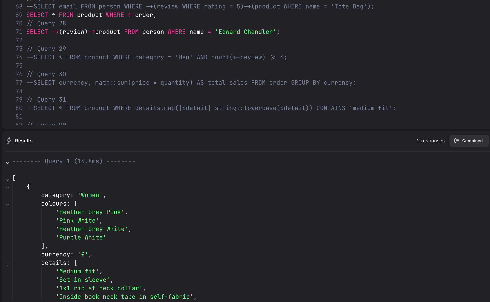
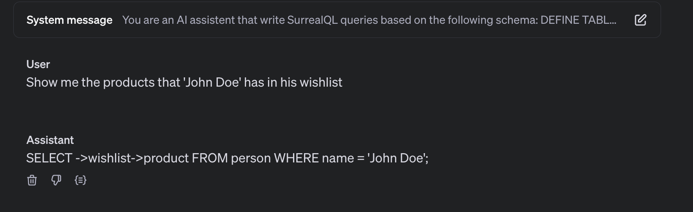

# Fine-tuned Surreal-4o Model for SurrealQL Queries

This project fine-tunes OpenAI's 4o-mini model to generate accurate SurrealQL queries from natural language prompts. The training data is organized into three syntax categories:

1. **Data Models**
2. **Functions**
3. **Statements**

Each category contains more than 100 examples per version in JSONL format, including system prompts, user messages, and corresponding SurrealQL queries.

## Workflow

The following workflow explains how to contribute and add more valuable training datasets to this repository. By following these steps, you can help expand the collection of high-quality examples that improve the model's ability to generate accurate SurrealQL queries.

### 1. Prepare Base Dataset

Create a `base.jsonl` file with the following structure:

```jsonl
{
	"messages": [
		{
			"role": "system",
			"content": "system_message"
		},
		{
			"role": "user",
			"content": "Write a query to get all persons email"
		},
		{
			"role": "assistant",
			"content": "SELECT email FROM person;"
		}
	]
}
```

### 2. Enhance with LLM

Use OpenAI's o1 Model to expand the dataset, following the [syntax instructions](./statements/select/syntax.md).

### 3. Extract & Validate Queries

```bash
python3 extract_queries.py ./statements/select/01-base.jsonl
```

Test extracted queries in [Surreallist.app](https://surrealist.app) using the demo dataset.



### 4. Inject Schema

```bash
python3 inject_schema.py ./statements/surreal-deal-store-min.surql ./statements/select/01-base.jsonl
```

This merges the schema with the system prompt, ensuring schema-compliant queries.

## Example Schema Injection

**Schema (surreal-deal-store-min.surql):**

```surrealql
DEFINE TABLE product SCHEMAFULL;
DEFINE FIELD name ON product TYPE string;
```

**Output (01-patch.jsonl):**

```json
{
	"role": "system",
	"content": "You are a helpful AI assistant that generates SurrealQL queries based on the following schema:\n\nDEFINE TABLE product SCHEMAFULL;\nDEFINE FIELD name ON product TYPE string;\n\nGenerate SurrealQL queries based on this schema."
}
```

## Fine-tuning

Upload the prepared dataset to OpenAI's platform and fine-tune the 4o-mini model following the [fine-tuning guide](https://platform.openai.com/docs/guides/fine-tuning).

## Result

A fine-tuned model capable of generating accurate SurrealQL queries from natural language, adaptable to specific schemas.



## Potential Applications: AI Agent (Sidekick) for SurrealQL

The fine-tuned model can serve as the foundation for a powerful AI agent specialized in SurrealQL query generation:

1. **Schema-Aware Query Assistant**

   - Automatically adapts to any provided database schema
   - Generates contextually relevant and syntactically correct queries
   - Understands relationships and constraints defined in the schema

2. **Natural Language to SurrealQL**

   - Translates plain English requests into optimized SurrealQL queries
   - Handles complex query requirements while maintaining schema compliance
   - Provides explanations and alternatives for generated queries

3. **Query Optimization Agent**

   - Suggests performance improvements for existing queries
   - Recommends appropriate indexes based on query patterns
   - Identifies potential bottlenecks in query execution

4. **Interactive Query Builder**
   - Guides users through query construction
   - Offers real-time suggestions and corrections
   - Validates queries against schema constraints

This agent could be integrated into various tools and platforms, making SurrealDB more accessible to developers of all skill levels.
